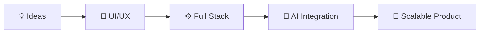

<div align="center">


<br/>

<p align="center">
  <a href="https://digvijay-tripathy.netlify.app/" target="_blank">
    
  </a>
  <a href="https://www.linkedin.com/in/digvijay-tripathy-194aa8314/" target="_blank">
    
  </a>
  <a href="mailto:tripathydigvijay7377@gmail.com">
    
  </a>
  <a href="https://github.com/DIGVIJAY-TRIPATHY" target="_blank">
    
  </a>
</p>

<p align="center">
  
</p>


</div>

---

## 🧠 About Me

```javascript
const DIGVIJAY = {
    location:     "📍 Bhubaneswar, Odisha, India 🇮🇳",
    role:         "💻 Full-Stack Developer",
    currentFocus: ["⚛️ React.js", "▲ Next.js", "🟢 Node.js", "🤖 AI Integration"],
    passion:      "🎨 Building modern, animated & responsive web applications",
    mission:      "🚀 Bridge AI × Web Development — build products that matter",
    mindset:      "🧠 Always curious about new frameworks & technologies",
    superpower:   "✨ Turning coffee into pixel-perfect interfaces",
    philosophy:   "Great design + Clean code = Magic 💫",
    openTo:       ["🤝 Collaborations", "💼 Freelance", "🌱 Open Source"],
};
```
## 🛠️ Tech Stack

<div align="center">

### ⚛️ Frontend


### 🟢 Backend & Database


### 🎨 Animation & Design


### 🤖 AI & Emerging Tech


### 🔧 Tools & DevOps


</div>

---

# 🚀 Featured Projects

<div align="center">

<table>
<tr>
<td width="50%" valign="top">

# 🌐 Portfolio Website


<br/><br/>


### ✨ Features

* ⚡ Smooth page transitions
* 🎨 Fully responsive modern UI
* 🌙 Dark mode support
* 🚀 Optimized performance
* ✨ Framer Motion animations

### 🛠️ Tech Stack

<p>

</p>

### 🔗 Links

<a href="https://digvijay-tripathy.netlify.app/" target="_blank">
  
</a>

<a href="https://github.com/DIGVIJAY-TRIPATHY/PORTFOLIO" target="_blank">
  
</a>

</td>

<td width="50%" valign="top">

# 📄 Resume Builder


<br/><br/>


### ✨ Features

* 📄 Dynamic resume generation
* 🎨 Modern responsive templates
* ⚡ Real-time live preview
* 🖨️ Download resume as PDF
* 🔥 Interactive UI experience

### 🛠️ Tech Stack

<p>

</p>

### 🔗 Links

<!-- <a href="https://github.com/DIGVIJAY-TRIPATHY" target="_blank">
  
</a> -->


</td>
</tr>
</table>

</div>

---

# ⚡ Project Vision

<div align="center">



</div>

---

# 🌟 More Projects Coming Soon...

<div align="center">


</div>

---


---

## 📊 GitHub Analytics

<div align="center">
  
</div>


<div align="center">
  
</div>

---

<!-- ## 🏆 GitHub Trophies

<div align="center">
  
</div> -->

---

## 💡 Philosophy

> *"In the era of AI, code is no longer just written — it's co-created. The future belongs to developers who think beyond syntax, design with empathy, and build with intelligence."*

> *"Great UI makes code feel alive. Great code makes UI feel effortless."*

---

## 🤝 Let's Connect & Collaborate!

<div align="center">

**Open to collaborations, freelance opportunities, and interesting projects!**

<a href="mailto:tripathydigvijay7377@gmail.com">
  
</a>
&nbsp;
<a href="https://digvijay-tripathy.netlify.app/" target="_blank">
  
</a>
&nbsp;
<a href="https://www.linkedin.com/in/santosh-kumar-dash-417a30274/" target="_blank">
  
</a>

<br/><br/>

⭐ **If you find my work interesting, feel free to star my repositories!**

</div>

---

<div align="center">


**💻 Made with 💙 by DIGVIJAY TRIPATHY — Bhubaneswar, India**

</div>